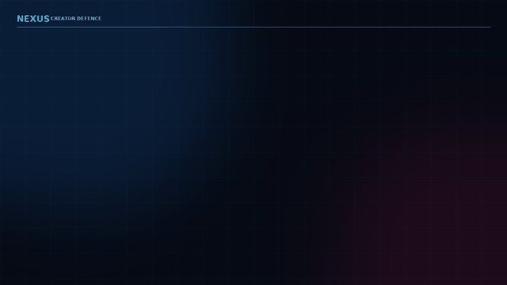

# NEXUS AI

**Symulacja rozchodzenia się podejrzanych informacji w sieci społecznej**

NEXUS AI to prototyp wspierający analizę scenariuszy, w których fałszywa lub niepotwierdzona wiadomość trafia do sieci kontaktów. Projekt ma pokazać, jak struktura sieci, zainteresowania odbiorców i właściwości wiadomości mogą wpływać na jej dalsze przekazywanie oraz które części sieci warto zweryfikować w pierwszej kolejności.

> **Status:** obecna wersja jest demonstracją opartą na syntetycznych danych i jawnych heurystykach. Nie jest zwalidowanym systemem wykrywania dezinformacji ani produkcyjnym narzędziem do oceniania prawdziwych osób lub kont.

## Demo



Animowany przebieg przykładowego studium przypadku: [`networkx_defence_case_study.gif`](networkx_defence_case_study.gif). Statyczny widok grafu: [`networkx_defence_graph.png`](networkx_defence_graph.png).

## Problem i zastosowanie

Podszywanie się pod rozpoznawalne osoby lub instytucje może zwiększyć wiarygodność i zasięg podejrzanej treści. W sytuacji incydentu analitycy potrzebują szybko zrozumieć, którędy treść może się rozchodzić i gdzie jej wpływ może być największy.

NEXUS AI rozwijamy jako narzędzie do **symulacji scenariuszy i wspomagania decyzji**. Przykład influencerów jest demonstracyjnym use case'em; docelowo podobne podejście może być zastosowane do różnych typów sieci, wiadomości i sytuacji kryzysowych. Wyniki mają wskazywać obszary do weryfikacji przez człowieka, a nie automatycznie orzekać o prawdziwości informacji lub intencjach użytkowników.

## Jak działa obecne MVP

Skrypt `symulacja_na_heurze.py` buduje przykładową skierowaną sieć złożoną z pięciu fikcyjnych profili influencerów, jednego fikcyjnego konta podszywającego się oraz dziesięciu fikcyjnych odbiorców. Węzły mają syntetyczne wektory zainteresowań, a krawędzie reprezentują przykładowe kontakty lub wiadomości.

MVP:

1. tworzy graf i zestaw przykładowych wiadomości;
2. oblicza heurystyczny wynik podobieństwa konta podejrzanego do profili influencerów;
3. symuluje przekazywanie wybranej wiadomości metodą Independent Cascade;
4. zapisuje animację przebiegu sieci oraz statyczny wykres.

Wagi, progi, profile, treści i wyniki w demonstracji są syntetyczne. Prawdopodobieństwo przekazania jest wyliczane według jawnego wzoru w kodzie, a nie przewidywane przez wytrenowany model.

## Planowany model predykcyjny

Model predykcyjny jest **planowanym komponentem**, nie częścią obecnego MVP. Jego zadaniem będzie szacowanie prawdopodobieństwa dalszego przekazania wiadomości lub czasu dotarcia do kolejnych części sieci, na podstawie opisanych i dostępnych danych.

Przed treningiem potrzebne będą m.in. zdarzenia z nadawcą, odbiorcą i czasem, cechy wiadomości, kontekst relacji oraz jasno określona zmienna docelowa. Brak zdarzenia udostępnienia nie dowodzi, że użytkownik zobaczył treść i ją zignorował: mógł jej nie otrzymać lub jej nie zobaczyć. Model i symulacja powinny zatem uwzględniać niepewność ekspozycji oraz ograniczenia i stronniczość dostępnych danych.

Planowany proces oceny powinien obejmować podział danych bez przecieku czasowego lub sieciowego, porównanie z prostymi baseline'ami, kalibrację prawdopodobieństw oraz testy na scenariuszach innych niż treningowe. Wyniki należy przedstawiać jako estymacje z niepewnością, z możliwością weryfikacji przez analityka.

## Uruchomienie

Wymagany jest Python 3.10 lub nowszy.

```bash
git clone https://github.com/laplasjan/nexus.git
cd nexus
python -m venv .venv
```

Aktywacja środowiska:

```bash
# Windows PowerShell
.venv\Scripts\Activate.ps1

# macOS / Linux
source .venv/bin/activate
```

Instalacja zależności i uruchomienie demonstracji:

```bash
python -m pip install -r requirements.txt
python symulacja_na_heurze.py
```

Skrypt zapisuje `networkx_defence_case_study.gif` i `networkx_defence_graph.png` w bieżącym katalogu. Wykres otwiera okno Matplotlib; w środowisku bez interfejsu graficznego należy użyć backendu bez okna lub rozdzielić generowanie wykresu od jego wyświetlania.

## Docelowa struktura repozytorium

Repozytorium będzie stopniowo porządkowane do poniższego układu. Obecny skrypt można na czas migracji pozostawić w katalogu głównym; proponowane miejsce docelowe to `src/nexus/simulation/`.

```text
nexus/
├── README.md
├── requirements.txt
├── pyproject.toml                 # konfiguracja pakietu, narzędzi i testów
├── .gitignore
├── src/
│   └── nexus/
│       ├── __init__.py
│       ├── config.py              # ustawienia i ziarna losowości
│       ├── data/                  # walidacja i ładowanie danych
│       ├── detection/             # heurystyka, później model podszywania
│       ├── simulation/            # graf, dyfuzja, przebieg zdarzeń
│       ├── prediction/            # przyszły trening i inferencja modelu
│       ├── evaluation/            # metryki, baseline'y i analiza niepewności
│       └── visualization/         # grafy i animacje
├── tests/                         # testy logiki, walidacji i scenariuszy
├── data/
│   ├── README.md                  # pochodzenie, schemat i ograniczenia danych
│   ├── raw/                       # dane źródłowe, domyślnie poza Git
│   └── processed/                 # dane przygotowane, domyślnie poza Git
├── models/                        # wersjonowane artefakty modeli, jeśli potrzebne
├── outputs/                       # lokalne wykresy i animacje; domyślnie poza Git
├── docs/
│   ├── ARCHITECTURE.md
│   ├── DATA_AND_ETHICS.md
│   ├── ROADMAP.md
│   └── references.md
└── assets/
    ├── demo/                      # GIF/MP4 i obrazy do README
    └── screenshots/               # kadry z demonstracji
```

Szczegóły odpowiedzialności katalogów i kolejność migracji opisuje [`REPO_STRUCTURE.md`](REPO_STRUCTURE.md).

## Możliwe kolejne kroki

- rozdzielić generowanie danych, model sieci, symulację i wizualizację;
- przenieść ustawienia i dane syntetyczne z globalnego zakresu do jawnych konfiguracji;
- dodać interfejs CLI z wyborem scenariusza, ziarna losowości i ścieżki wynikowej;
- utrwalić schemat danych zdarzeń, w tym nadawcę, odbiorcę, czas, typ zdarzenia i źródło informacji;
- odróżnić kontakt w grafie od faktycznej ekspozycji i udostępnienia wiadomości;
- umożliwić wiele powtórzeń symulacji i raportować rozkład wyników zamiast pojedynczego przebiegu;
- porównać heurystyki z prostymi baseline'ami i oceniać je na danych oddzielonych od treningu;
- dodać testy, logowanie, walidację wejścia i zapis wyników do CSV/JSON;
- przygotować warstwę wizualną pokazującą zasięg, tempo, niepewność i źródła estymacji.

## Odpowiedzialne użycie i dane

Wszystkie profile i zdarzenia w aktualnej demonstracji są fikcyjne. Przed użyciem danych rzeczywistych należy sprawdzić ich licencję, podstawę przetwarzania, zakres zgody, minimalizację danych oraz możliwość reidentyfikacji. Nie należy publikować danych osobowych ani wnioskować o wiarygodności realnych osób na podstawie samego wyniku modelu.

## Wykorzystane technologie

- Python
- NetworkX — graf skierowany i analiza sieci
- NumPy — obliczenia numeryczne
- Matplotlib — wykresy i animacje
- Pillow — zapis animacji GIF

## Zasoby i wkład

Projekt jest przygotowywany w ramach wyzwania Defence HackYeah. Zasady zadania dopuszczają użycie zewnętrznych zasobów pod warunkiem ich właściwego wskazania; istotne modele, zbiory danych, API, biblioteki i materiały należy opisać w dokumentacji projektu. Szczegóły znajdują się w [`docs/references.md`](docs/references.md) (do uzupełnienia przed publikacją).

Zgłoszenia, błędy i propozycje usprawnień można dodawać przez GitHub Issues.
